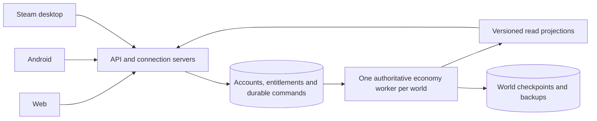

# Technology strategy and annual subscription economics

Research date: 3 October 2026. Status: recommended architecture and stack; Python throughput and multiplayer capacity remain to be measured. This document records research, not an engine migration or a deployment commitment.

Use one authoritative world shared by web, Android and Steam. Build the economy in Python with NumPy arrays and Numba compiled kernels, with a separate Python FastAPI service for player connections. Use PostgreSQL for durable accounts, entitlements and ordered commands, and object storage for versioned world checkpoints and backups. Share a TypeScript client across interfaces. This fits the current economic model and the requested Python preference while keeping performance changes local to the kernel.

The user clarified annual pricing: $5 for Tier 1 and a nominal $15 for Tier 2, with platform fees added. The subsequent instruction is to forecast only **$5 net annual receipts per company in both tiers**, because most Tier 2 access will be heavily discounted for existing players. A shared economy is preferred if practical. It is practical in this design: platforms submit the same game commands; authentication, billing and packaging use platform adapters. Player slots and simultaneous connections remain different sizing inputs. Until measured, budget for both a normal concurrency case and every slot connected.

## Existing project evidence

The current source models 20 Tier 0 firms, 1,000 Tier 1 firms, 61,950 Tier 2 firms and one million robotic procurement agents. Tier 2 starts with 232,000 product routes. Tier 1 is the planned first player release; the full downstream simulation still runs before those firms become playable. The economic contract explicitly says multiplayer is absent.

The engine already uses typed arrays and a separate browser worker. Preserve these useful boundaries. The local Python `serve.py` is a static file server; the economy itself currently executes JavaScript. The fixed scheduler waits 500 ms after doing a tick and publication, so its actual wall-clock period includes computation. Production must use deadline scheduling and an explicit overload policy.

A local benchmark on 3 October ran the actual worker through 240 full-population ticks, discarding the first 60 for steady-state statistics. Node v24.12.0 on macOS arm64 measured mean 529.23 ms, p50 499.10 ms, p95 688.61 ms and p99 1,130.21 ms per tick. Typed arrays occupied 125.02 MiB and process RSS was 422.52 MiB. One full admin publication took 73.72 ms and serialized to 591,350 bytes. Another economy research process was using CPU concurrently, so these timings include contention and are not an isolated server benchmark. This sample covers early operation, not a mature full Age. No Python performance measurement is claimed. These results do not establish sustained production throughput at the user's minimum 1.3 ticks per second.

Do not infer 63,000-player hosting capacity from a successful simulation run. Economy compute, connection handling, personalized reads, durable commands and bandwidth need separate measurements. The one million procurement agents are server state, not one million network connections.

## Stack selection

| Layer | Recommended choice | Reason and decision boundary |
| --- | --- | --- |
| Economic rules and orchestration | Python | Supports the requested development workflow and numerical research; remains independent of HTTP and UI code. |
| Economic state | NumPy arrays, explicit dtypes | Preserve the current compact layout; avoid a million Python objects or ORM rows in the hot path. |
| Hot loops | Numba in nopython mode | Compiles compatible numerical Python. Verify the actual purchasing and matching loops, not only vector arithmetic. |
| Public API and connections | FastAPI, Uvicorn, HTTPS and WebSocket | Start with one backend language. Run independently of the CPU-bound economy worker. |
| Durable operational data | PostgreSQL, SQLAlchemy and Alembic | Accounts, ownership, subscriptions, command order, schema migrations and audit records. |
| World persistence | Versioned array checkpoints in object storage plus PostgreSQL command/tick records | Avoid updating a million database records every tick. |
| Shared UI | TypeScript, React and Vite | Recommended for the current dashboard-oriented product; reuse the current model's views and calculations through read APIs. |
| Android | Capacitor wrapper with platform adapters | Reuses the web UI; separately implement billing, lifecycle handling, touch layouts and notifications. |
| Steam desktop | Electron wrapper, subject to a Steam integration spike | Reuses the web UI; test native Steamworks binding, authentication, packaging and billing before freezing the wrapper. |
| Deployment | Linux containers, Docker Compose initially, infrastructure as code | Keep services movable between machines. Add a cluster scheduler when operations justify it. |
| Observability | OpenTelemetry, Prometheus and Grafana | Measure tick deadlines, command latency, queue depth, connection memory, traffic and recovery. |
| Cache and fanout | Optional Redis or Valkey | Add for measured caching/routing needs; durable commands remain in PostgreSQL. |

These are engineering recommendations, not claims that a framework guarantees a user count. [Numba documentation](https://numba.readthedocs.io/en/stable/user/performance-tips.html) describes compiled loops and relaxed floating-point behavior. Keep `fastmath=False`; do not parallelize shared-inventory matching until ordering and conservation remain correct. Pin a Python/NumPy/Numba combination verified on production Linux, rather than independently selecting the newest releases.

[FastAPI deployment guidance](https://fastapi.tiangolo.com/deployment/concepts/) explains separate worker processes and their memory copies. The economy must not be initialized separately inside every API worker. [Capacitor](https://capacitorjs.com/docs) supports web UI reuse on mobile. Apply [Electron's security guidance](https://www.electronjs.org/docs/latest/tutorial/security) to the desktop wrapper: package trusted UI, isolate contexts and expose only narrow native bridges.

## Alternatives and rewrite risk

| Option | Assessment for this project |
| --- | --- |
| Existing JavaScript engine on Node.js | Lowest immediate migration effort and a credible fallback. Useful as the reference implementation during the Python comparison. CPU work needs worker/process isolation from connections. |
| Ordinary Python loops and object graphs | Convenient for small reference fixtures; do not assume they meet full-world latency or memory targets. |
| Python with NumPy and Numba | Preferred direction. Requires translating rules and reproducing random streams, ordering and numerical behavior. |
| Python with a Rust extension | Contingency for measured hotspots. Keep Python orchestration and replace a narrow array-in/array-out kernel. |
| Entire server in Rust, Go or C# | Viable candidates, but currently offers no measured advantage sufficient to justify a complete migration and extra learning surface. |

[Node.js documentation](https://nodejs.org/learn/asynchronous-work/dont-block-the-event-loop) explains why expensive computation needs isolation. [PyO3](https://pyo3.rs/) provides a Rust/Python integration route if needed. The comparison above is project-specific judgment; no unmeasured speedup is asserted.

Keep the existing JS engine as an executable oracle until the Python kernel passes economic equivalence checks. Do not maintain independent production economic rules in both the client and server. If future gameplay requires substantial 3D presentation, reevaluate the rendering client separately; that does not require replacing the backend.

## Shared world architecture

One world is a logical unit, not one physical machine. Scale API servers and read services independently. Only the economy worker advances state. On restart or failover, a fenced ownership lease prevents two workers from advancing the same world. A standby recovers checkpoints and the ordered command history; it must not run a second conflicting economy.

Player commands need account and company authorization, an idempotency key, server-assigned sequence, target tick and an applied/rejected result. Accepting a command is distinct from applying it. Persist commands before acknowledging acceptance, validate at the application tick, and enforce pricing, equipment and ownership rules on the server. Define cutoff times and a fair ordering policy so reconnects, retries and differing platform latency cannot silently duplicate actions or bypass constraints.

Create immutable read projections once per world update. Send players their own company data, subscribed markets and small deltas; paginate other firms. Never send full-world state, the robotic buyers or admin permissions to ordinary clients. Bound slow-client queues and send a fresh snapshot when resynchronization is needed. Mobile suspension affects the connection; the company's automation continues according to explicit gameplay rules.

Platform identities map to one internal account. Entitlements are separate from company assets and gameplay cash. Validate receipts and signed webhooks server-side, handle duplicate delivery/refunds/renewals, and define company behavior after expiry. A player may switch interfaces without creating duplicate ownership. The exact ability to purchase on one storefront and use access elsewhere must follow that storefront's terms; shared simulation does not decide checkout rules.

Tier 1 and Tier 2 cannot be partitioned into independent economic servers while retaining the existing direct supply chains. Sector partitions also share Tier 1 inputs. Scale a world vertically first; later parallelize independent stages with stable ordering. Additional independent worlds can scale horizontally, with their economic isolation explicit to players. Different platforms do not require different worlds.

## Fundamentals to establish before networking

1. Define the server-owned `WorldState`, ordered `CommandBatch`, tick result and read projection contracts independently of framework code. Use stable world/company/product/account IDs and schema versions.
2. Fix real-world tick cadence separately from simulated years and Ages. The user requires at least 1.3 ticks per second: a maximum scheduled period of approximately 769.23 ms, or 112,320 ticks per 24 hours of uninterrupted operation. At exactly that rate an existing 172,800-tick Age takes approximately 36.92 hours. The earlier five-second free-hosting suggestion is superseded.
3. Specify arithmetic, rounding and random streams. Platform billing uses integer currency amounts. Choose fixed-point or defined floating-point rules for game money after checking effects on calibration; do not silently round away current small economic values.
4. Make save/load and replay cover inventories, cost bases, learned prices, relationships, RNG behavior, ownership, pending commands and the exact engine/configuration version. Cross-language floating-point equivalence needs defined tolerances; same-build restart replay should be stricter.
5. Couple a completed tick's command results and checkpoint reference through an atomic durable commit. Persist uploads before referencing them, expose only committed projections, and recover incomplete ticks without double application. [PostgreSQL WAL](https://www.postgresql.org/docs/current/wal-intro.html) protects database changes, but does not automatically persist RAM arrays or object-store files.
6. Keep gameplay subscription money separate from simulated company money, and keep administrative permissions separate from player command handlers.

## Capacity and hosting budget

Budget assumptions: one region, one full economy, modest command frequency, small personalized updates and self-managed value hosting. These are planning allowances, not load-tested quotations. They exclude salaries, customer acquisition, tax, support labor and exceptional attacks or traffic. Peak simultaneous users and average simultaneous users must both be measured.

| Stage | Illustrative deployment | Monthly infrastructure allowance |
| --- | --- | ---: |
| Private PoC | One machine with separate processes plus off-machine backup | $50–150 |
| Tier 1 launch, up to 1,000 simultaneous users | Economy host, separate data/API capacity, backup and monitoring | $250–600 |
| Full 62,950 slots, up to about 6,300 simultaneous users | Active/standby economy hosts, redundant gateways/data services, backups | $600–1,500 |
| Full 62,950 simultaneously connected | Larger gateway/read fleet and measured fanout/traffic capacity | $1,500–4,000 provisional reserve |

The full-concurrency range can rise substantially with frequent queries, costly history, large payloads or managed cloud services. A provisional compute basket is two AX42-class economy hosts ($234.20/month), two CCX23-class data hosts ($202.98/month), and two CPX32-class API hosts ($83.98/month): $521.16 before storage, backup, monitoring, load balancing, IPv4, setup and tax. This illustrates the middle stage's lower bound, not machine suitability or tested redundancy.

[Hetzner's June 2026 price list](https://docs.hetzner.com/general/infrastructure-and-availability/price-adjustment/) lists European AX42-1 at $117.10/month, CCX23 at $101.49 and CPX32 at $41.99, excluding VAT and IPv4. AX42 setup is $59. [AX42 specifications](https://www.hetzner.com/dedicated-rootserver/ax42/) describe the hardware and standard unlimited-traffic policy; hardware and availability must be checked at order time. Dedicated CPU resources are preferable for predictable simulation timing.

At an assumed 1 KB/second per connection, 63,000 continuously connected players produce about 63 MB/second and 163.3 TB over 30 days, before transport overhead. At 6,300 average connections that is 16.3 TB. Traffic scales with average concurrency, rather than the annual subscriber count. [Hetzner billing documentation](https://docs.hetzner.com/cloud/billing/faq/) distinguishes chargeable outgoing traffic; region, included allowances and the selected host's policy determine the bill.

If web, Android and Steam each had their own full world, totals would be three times the slots and simulation workload: 188,850 company slots, three million robotic buyers and three independent authoritative workers. Some API/account infrastructure could be shared. For three worlds each reaching full simultaneous occupancy, reserve roughly $4,500–12,000/month under the same provisional assumptions. The shared design avoids this unnecessary economic fragmentation.

## Free hosting with Tier 0 players

For a bot economy with only Tier 0 human players, the current topology has 20 potential player companies if each firm has one owner. Network and account work are small, but the full downstream economy still runs. The minimum 1.3 ticks per second applies to this stage too.

[Oracle Always Free documentation](https://docs.oracle.com/en-us/iaas/Content/FreeTier/freetier_topic-Always_Free_Resources.htm), checked on 3 October 2026, lists an ARM allocation equivalent to 2 OCPUs and 12 GB RAM, with 200 GB combined boot/data volume storage. Free shapes may be unavailable in a region and idle instances may be reclaimed. Oracle is a plausible candidate to benchmark, not a demonstrated fit at the required cadence.

The local mean of 529.23 ms would consume about 69% of one execution core's wall-clock budget at 1.3 ticks per second, before publication and persistence, if that timing transferred unchanged. It will not necessarily transfer to Ampere hardware. Its p99 of 1,130.21 ms exceeds the 769.23 ms period. Occasional overruns can be recovered if subsequent ticks have headroom, but the host must show sustained committed throughput with bounded lag. Two cores allow API/database work to run separately; they do not automatically double a sequential economic kernel's speed.

The proposed acceptance target is p99 kernel time at or below 400 ms, with the entire committed tick normally within 769.23 ms, under realistic player commands, read publication and checkpoint activity. Run a full-world 24-hour soak on the intended VM and verify at least 112,320 committed ticks, bounded lag and no dropped economic ticks. Report interruption/recovery separately. If the VM fails, optimize the kernel or move to a faster paid host while preserving this cadence. Do not reduce the economic population or silently slow the world to make the free tier pass.

## Annual revenue and platform fees

Revenue assumes one paid subscription per occupied company slot. Company slots are not sales forecasts, concurrent connections are not annual subscribers, and one person owning multiple companies requires a separate product decision. The forecast uses $5 net annual receipts per company for both tiers, after discounts and payment/platform fees, before hosting and other operating costs. Do not subtract those fees again from the forecast. The $15 Tier 2 nominal price is retained for retail pricing examples only. If existing-player offers bundle several companies into one payment, substitute the actual retained amount per company-year.

| Paid slot occupancy | Tier 1 subscribers | Tier 2 subscribers | Annual net receipts at $5 each | Monthly equivalent |
| --- | ---: | ---: | ---: | ---: |
| Tier 1 launch only | 1,000 | 0 | $5,000 | $416.67 |
| About 10% of each tier | 100 | 6,195 | $31,475 | $2,622.92 |
| Half of each tier | 500 | 30,975 | $157,375 | $13,114.58 |
| Full current world | 1,000 | 61,950 | $314,750 | $26,229.17 |

Using the rounded 62,000 Tier 2 target gives $315,000/year instead. Annual subscriptions provide cash at purchase/renewal; monthly equivalents do not mean monthly billing or cash receipts. Renewal retention, refunds, taxes and acquisition costs determine actual results. Nominal undiscounted retail at $5/$15 would total $934,250 before fees, but that is not the accepted forecast.

For comparison only, if nominal $5/$15 were the customer checkout prices with no discounts, fee deductions would be as follows. Each row hypothetically puts every subscriber on that payment channel; the rows are alternatives, not additive revenue. These nominal-price cases do not replace the $5-net-per-company forecast above.

| Channel assumption | Tier 1 retained per year | Tier 2 retained per year | Full-world retained annually before other costs |
| --- | ---: | ---: | ---: |
| Web card processing at 2.9% + $0.30 | $4.555 | $14.265 | $888,271.75 |
| Web merchant of record at 5% + $0.50 | $4.25 | $13.75 | $856,062.50 |
| Google Play auto-renewing subscription at 15% total | $4.25 | $12.75 | $794,112.50 |
| Steam planning commission at 30% | $3.50 | $10.50 | $653,975.00 |

[Stripe's US reference pricing](https://stripe.com/pricing) supplies the card example; country, international-card, FX and subscription-billing charges may differ. This is not an assertion of eligibility for a Turkish business: confirm the legal entity and [supported merchant countries](https://stripe.com/global) before selecting a provider. [Paddle pricing](https://www.paddle.com/pricing) gives the merchant-of-record example and invites custom pricing for transactions below $10.

[Google Play's current fees](https://support.google.com/googleplay/android-developer/answer/112622?hl=en) list auto-renewing subscriptions at 10% plus 5% Play billing in rolled-out regions, and 15% in remaining markets. Other transaction fees depend on region, installation timing and program participation. The 15% assumption is for standard Play-billed auto-renewing subscriptions, not every Android transaction.

Use 30% as the Steam budget assumption at this revenue level; the [UK CMA report](https://assets.publishing.service.gov.uk/media/63f61bc0d3bf7f62e8c34a02/Mobile_Ecosystems_Final_Report_amended_2.pdf) documents the 30% starting share and higher-revenue tiers. Confirm the current signed distribution agreement. [Steam Direct](https://partner.steamgames.com/steamdirect/) adds a $100 product fee, recoupable after $1,000 adjusted gross revenue. [Steam subscription documentation](https://partner.steamgames.com/doc/store/pricing/subscriptions?l=english) says recurring subscriptions are not fully supported; [recurring in-game billing](https://partner.steamgames.com/doc/features/microtransactions/recurring_billing) requires an agreement workflow. Steam annual access needs a separate integration/product validation, potentially using a supported term-based entitlement if appropriate.

To retain a target amount and pass fees into pricing, gross up instead of adding the fee percentage. For a percentage `r` and fixed fee `f`, customer price before tax is `(desired retained amount + f) / (1 - r)`. In the table below the first column applies to Tier 1 and discounted Tier 2 at the forecast's $5 net target; the second shows nominal Tier 2 retail retaining $15.

| Channel assumption | Price retaining $5 for either tier | Nominal Tier 2 price retaining $15 |
| --- | ---: | ---: |
| Web card processing | $5.46 | $15.76 |
| Web merchant of record | $5.79 | $16.32 |
| Google Play at 15% | $5.89 | $17.65 |
| Steam at 30% | $7.15 | $21.43 |

These are amounts rounded upward to cents to preserve the target before tax. Storefront price tiers, local currencies and required tax-inclusive display can require different final prices. Treat fees as an input to platform list pricing, rather than assume a separate checkout surcharge is available. A simple illustrative display set is $5.99/$15.99 on direct web cards, $5.99/$16.99 through the merchant-of-record example, $5.99/$17.99 on Play and $7.99/$21.99 on Steam; availability and permitted price relationships must be verified before adoption.

## Commercial implications

Tier 1 alone is financially tight. At a $5 retained annual subscription and 1,000 occupied slots, there is only $416.67/month available before infrastructure and all other costs. A $250–600/month hosting budget consumes 60–144% of that base revenue. This first release needs a lean deployment, a development subsidy, additional revenue or adjusted pricing; passing storefront fees through does not fix the low base amount.

Tier 2 changes the economics substantially even with discounts. At full occupancy, forecast annual net receipts are $314,750. Infrastructure of $600–1,500/month is $7,200–18,000/year; a full-concurrency reserve of $1,500–4,000/month is $18,000–48,000/year. The corresponding full-occupancy remainder after infrastructure alone is $296,750–307,550 or $266,750–296,750. These are not profit forecasts. At 10% occupancy there is only $31,475/year after assumed fees, before hosting and other expenses; the higher hosting reserve could exceed those receipts. If three separate platforms each had a full occupied world, their combined forecast would be $944,250/year, but a shared customer base does not automatically triple just because three interfaces exist.

Infrastructure-only break-even at the accepted $5 retained annual amount is 1,440 paid company-years for $600/month hosting, 3,600 for $1,500/month, and 9,600 for $4,000/month. Count paid companies across both tiers. If a discounted Steam checkout were $5 rather than grossed up, its $3.50 retained amount would instead require 2,058, 5,143 and 13,715 paid company-years. The latter is a fee-absorption sensitivity case, not the $5 net forecast. All counts exclude every non-hosting expense.

## Validation before the stack becomes a production commitment

The recommended direction is selected now. Production capacity remains conditional on these checks, undertaken before implementing the real client/server relationship:

1. Run the current kernel on the intended Linux host and record initialization, steady-state p50/p95/p99 tick duration, full process memory and publication cost. Benchmark the full world even for Tier 1 launch.
2. Port a representative complete economic path to Python/Numba, including sequential supplier choice, inventory mutation and learned state. Compare the same seeds, commands, costs and markets against the JS reference. Then measure the full kernel before retiring JavaScript.
3. Require sustained throughput of at least 1.3 ticks per second. Use a proposed p99 kernel budget at or below 400 ms and a total committed-tick budget normally below 769.23 ms under representative commands and persistence. Verify bounded scheduling lag over a 24-hour full-world soak, with no dropped economic ticks. Faster cadence is acceptable if stable. Validate cold-start compilation and recovery separately.
4. Replay at least 3,600 full-population ticks and takeover/equipment/shock scenarios. Require conservation, atomic orders, equivalent constraints and accepted numerical tolerances, alongside performance. Economic calibration remains a separate existing project task.
5. Exercise 1,000, 6,300 and 63,000 simulated connections with realistic subscriptions, command bursts, reconnects and slow clients. Proposed goals: stable queues/memory and p95 acknowledgement below 250 ms within the hosting region; command application latency is reported separately in ticks. Include database and checkpoint costs.
6. Kill and recover the economy worker and data services. Demonstrate no lost acknowledged durable commands, no duplicate economic actions, no simultaneous world writers, and a measured recovery objective, provisionally under 60 seconds. State the tolerated read-only interruption.
7. Validate annual billing, gross-up prices, receipts and refunds on Android and Steam sandboxes before committing platform packages. Keep billing issues independent of engine selection.

If Python misses the selected tick budget, profile first. Optimize layout and compile remaining hot loops; if necessary use a Rust extension for the bottleneck. If translation cost or performance remains unacceptable, retain the working Node.js kernel behind the same contracts. Both paths preserve account, persistence and client work.
